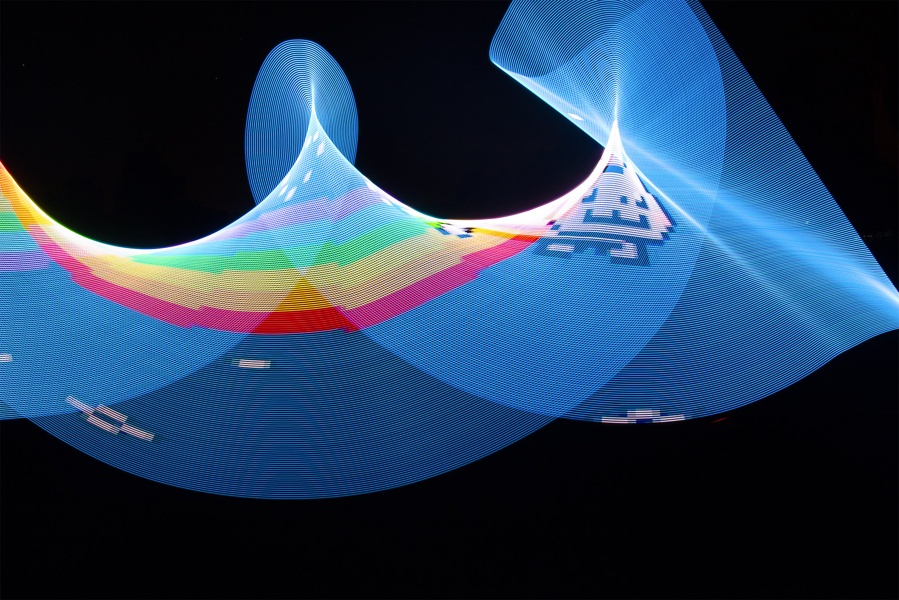

# Lightpainting stick
The project aims to create a light painting stick.
As the name suggests, the stick helps paint onto photos taken with a camera over prolonged exposure.
A Raspberry Pi controls the individual LEDs.
The Raspberry Pi is also configured as a WiFi access point, which serves as a web app.
Users connected to the app running on the Raspberry Pi can upload images to be drawn by the stick and control the drawing process.
Thanks to the web interface, the need for physical buttons is eliminated.
Uploading the images involves a downscale of their resolution so that the pixel count matches the number of LEDs in the stick.
Finally, the whole stick is powered by a power bank, which makes the entire setup portable and capable of drawing even in field conditions.
The image below showcases possible results achievable with the light painting stick.



The repository contains the code for Raspberry Pi's web interface and LED strip driver.
The web app is implemented with the help of the `Flask` and `adafruit_dotstar` library.

## Usage
Install the required packages by running the following command:
```bash
pip install -r requirements.txt
```
Run the server by executing the following command:
```bash
python main.py
```
Open the server in a web browser and start uploading images.
The drawing requires setting up the number of LEDs and the specification of the pins where the LED strip is connected.
The setup can be found in `neopixelWrapper.py`, and the fields to be edited are:
```python
self.num_pixels = 216 # Number of pixels in the DotStar strip
self.pin_sck = 11
self.pin_mosi = 10
```

### Disclaimer
This project does not include a production-ready version, and the authors assume the user's interest in the final pictures created using the light painting stick.
Thus, the code does not include any reasonable security measures.